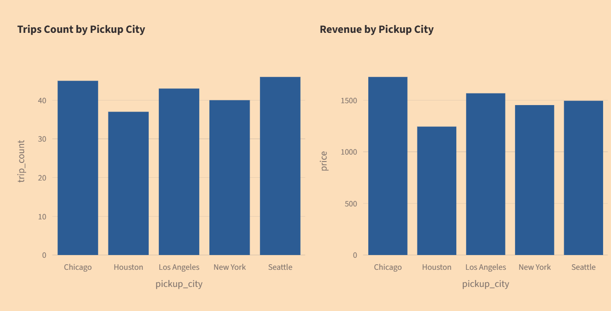
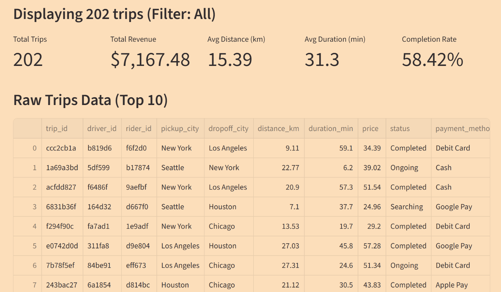
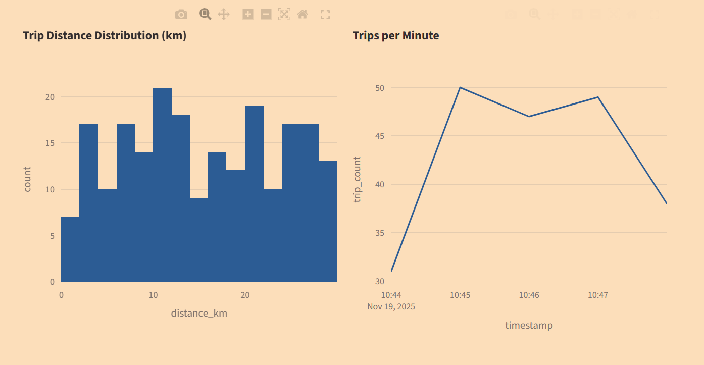

# Real-Time Ride-sharing Trips Streaming System
This project implements a real-time data pipeline using Apache Kafka, PostgreSQL, and Streamlit.
The original domain (e-commerce orders) is replaced with ride-sharing trip events.

The system:
- Generates synthetic ride-sharing events (producer)
- Streams data through Kafka
- Consumes events and stores them in PostgreSQL
- Displays a real-time dashboard using Streamlit

## Features
### Producer
- Generates synthetic trips using Faker
- Sends events to Kafka topic

### Consumer
- Reads events from Kafka
- Creates trips table automatically
- Inserts trip data into PostgreSQL

### Dashboard
- Built with Streamlit
- Auto-refreshing
- Displays latest trips and charts
- Allows filtering and record limit

### Project Structure
```
producer.py
consumer.py
dashboard.py
docker-compose.yml
requirements.txt
Images/
    producer.png
    consumer.png
    dashboard.png
    result_1.png
    result_2.png
    result_3.png
```

## How to Run
1. Start Kafka and PostgreSQL (Docker)
```
docker compose up -d
```

2. Start Consumer
```
python consumer.py
```

3. Start Producer
```
python producer.py
```

4. Run Dashboard
```
streamlit run dashboard.py
```
Then open http://localhost:8501 to see the result.

If eveything works in the correct way, here is something you will see:


